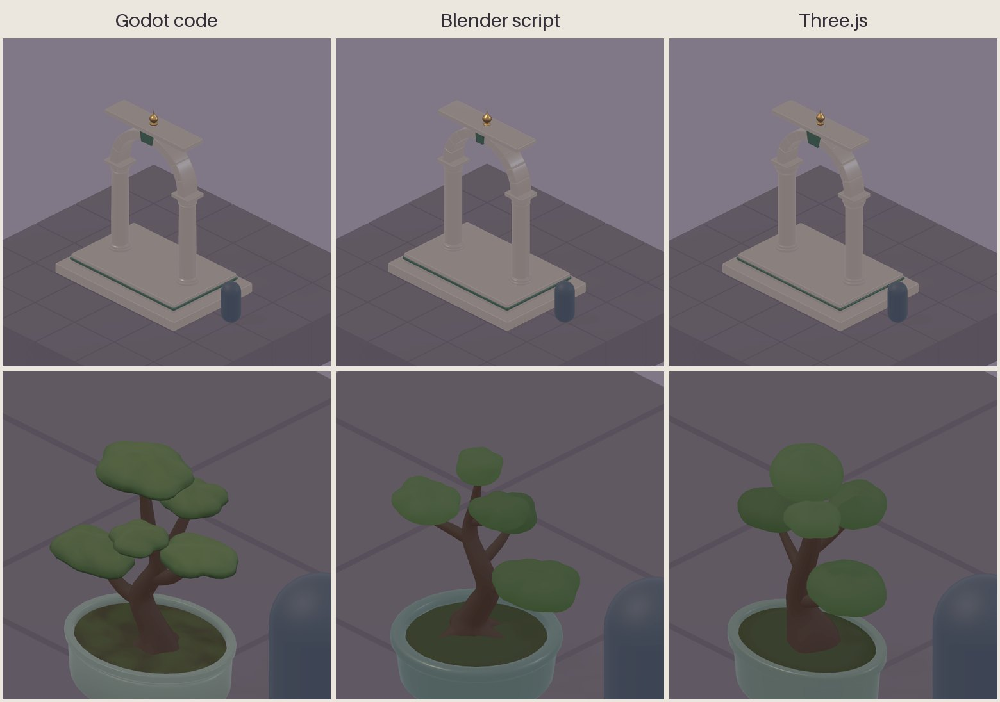

# Art pipeline: how agents can make polished 3D assets

Written 2026-10-06. The owner decided that agents alone make the game's art
and music, and asked for a way for agents to make high-quality, repeatable,
stable and polished 3D assets. Agent work in Blender had been weak, and the
owner asked whether Claude might do better with Three.js. This document
gives the answer from a hands-on pilot and from desk research, and proposes
a method. The method is a proposal until the owner agrees it;
`GAME_DESIGN.md` records only agreed decisions.

## In short

- **The tool is not the problem.** The same two assets, an architectural
  gate and an organic bonsai, were built from code in Godot, in Blender and
  in Three.js. All three reached the same clean result, in 21 to 23 minutes
  each. Every asset rebuilds byte for byte from its code.
- **Research agrees.** Across 2024–2026 benchmarks, what lifts agent-made
  3D is the working loop: exact specifications, a library of parts, numeric
  checks, renders from the game's own views, and a separate reviewer. No
  study shows Three.js beating Blender. The earlier Blender trouble came
  on the hardest case for every method, an animated character in a cloak
  and hood, not on the kind of asset this pilot tested.
- **None of the six assets is polished**, and the reason is not geometry.
  All of them look plain under the game's flat lighting and plain
  materials. In this genre, polish comes from lighting, palette, materials
  and composition over simple shapes. That is where the work goes next.
- **Generated 3D models** (from text or images) suit organic set dressing
  at best. They do not suit the architecture kit, or anything the mirror
  copies, because copies are real geometry the traveller walks on.
- **Steam requires a store-page disclosure of AI-generated art and music.**
  Part of the audience is hostile to it, so consistency and craft matter
  even more.

## The pilot

Three agents worked at the same time, one per route, from the same written
specification. A shared judge rendered every result in Godot's Mobile
renderer, with the game's lighting, from the game's four views and at the
size a player sees. The sources, the judge and the commands to rebuild
everything are in `art_trial/pipeline_pilot/`.

- **Gate:** a two-step plinth, two columns with bases and capitals, an arch
  of voussoirs with a jade keystone, a cap slab and a metal finial. Exact
  dimensions on the game grid, bevelled edges, under 6,000 triangles.
- **Bonsai:** a celadon pot, a curving trunk with roots and four branches,
  and five cloud-shaped foliage pads. About one block tall, under 8,000
  triangles.

*View 1 of each final asset, rendered by the judge. The blue capsule is the
traveller's size.*

| | Godot code | Blender script | Three.js |
| --- | --- | --- | --- |
| Wall time for both assets | 21 min | 22.5 min | 23 min |
| Judged rounds, gate / bonsai | 2 / 6 | 2 / 4 | 2 / 6 |
| Failures on the way | none; one engine import bug found | 1 crash, 2 builds with holes caught by its own checks, 1 non-deterministic export fixed | 1 build over budget caught before judging; 2 rounds spent on symptoms of a folding trunk |
| Lines of code (shared library included) | 534 | 526 | 430 |
| Triangles, gate / bonsai | 5,492 / 7,788 | 5,644 / 7,850 | 5,004 / 7,424 |
| Same file on every rebuild | yes | yes, after the fix | yes |
| Agent tokens | 211,000 | 223,000 | 232,000 |

What it showed:

- **The gates are practically identical.** Exact, grid-aligned
  architecture is easy for agents in any of the three tools. Each needed two
  rounds.
- **The bonsai shows the differences.** Organic forms took four to six
  rounds everywhere. The Godot version has the most character, with layered
  pads and darkened soil; the Blender pot looks the most like ceramic; the
  Three.js pads are the plainest domes. Every route left creases where the
  branches meet the trunk, a smooth-blend problem that none of them solved.
- **Each tool has its own traps.**
  - **Godot:** it has no modelling operators, so the agent wrote 221 lines
    of geometry maths by hand: bevels, lathes, bends and normals.
  - **Blender:** the Skin modifier left holes, the Bevel modifier's UVs
    changed between runs, and the pip build of `bpy` has an import-order
    quirk.
  - **Three.js:** a spline trunk folded between rings, and the exporter
    needs a small shim in Node.
- **The checks did the real work.** Holes, folds, inverted faces and
  non-deterministic exports were found by numeric checks, not by looking
  at renders. Renders found proportion and readability problems.
- **Godot 4.7.2 has a glTF import bug.** A part of a mesh gets vertex-colour
  albedo only if an earlier part of the same mesh has vertex colours, so the
  first part's vertex colours are always ignored. `vcol_test.gd` in the
  pilot folder shows it. Until it is fixed, put a part that needs no vertex
  colours first, or keep colour in materials.

## What the research found

Desk research ran in three tracks at the same time. Page fetches were
blocked by the environment's network policy, so it worked from search
extracts, GitHub and a few official pages, and the shared search quota ran
out before the end. **†** marks a fact from a single source.

### Agents modelling through code

- **Benchmarks:** the code runs and the object is recognisable, but
  proportions, exact dimensions and the way parts relate are often wrong,
  with floating parts the most common defect
  ([BlenderGym](https://openaccess.thecvf.com/content/CVPR2025/html/Gu_BlenderGym_Benchmarking_Foundational_Model_Systems_for_Graphics_Editing_CVPR_2025_paper.html),
  [3DCodeBench](https://arxiv.org/abs/2606.01057),
  [P3D-Bench](https://github.com/SpatiaOS/P3D-Bench)).
- **What measurably helps:**
  - retrieved examples and documentation
    ([BlenderRAG](https://arxiv.org/pdf/2605.00632));
  - execution feedback and numeric checks, which converged faster than
    visual inspection in one study
    ([CADCodeVerify](https://arxiv.org/abs/2410.05340v1),
    [L-bracket study](https://arxiv.org/abs/2509.07010v1));
  - placing parts one at a time with error correction
    ([study](https://arxiv.org/pdf/2504.05482));
  - a critic that reviews renders from several views
    ([LL3M](https://arxiv.org/html/2508.08228v1)).

  An agent's critique of its own renders is a known bottleneck, so a
  separate reviewer is better.
- **Three.js:** no study shows it beats Blender's Python for assets. One
  found a model's score varied up to 5.7 times across six scene languages
  ([SpatialBabel](https://arxiv.org/abs/2605.12586)), which is why the pilot
  measured it directly.

### Generated 3D models

- **The leading services** are Tripo, Meshy and Rodin.
  - **Tripo** says the same seed and input give the same mesh, and has a
    low-polygon mode
    ([docs](https://developers.tripo3d.com/en/docs/generation-image-to-model/standard.md)).
  - **Meshy** has the best editing: remeshing to a polygon target,
    retexturing from a style image, and removing baked lighting
    ([docs](https://docs.meshy.ai/ph/api/retexture)).
  - **Hunyuan3D's** licence excludes the EU, the UK and South Korea
    ([licence](https://huggingface.co/tencent/Hunyuan3D-2/blob/main/LICENSE)),
    which rules it out for a worldwide Steam release.
  - **TRELLIS.2** is MIT-licensed but needs a 24 GB GPU
    ([model](https://huggingface.co/microsoft/TRELLIS.2-4B)).
- **Weak points:**
  - Seeds do not make a model repeatable: GPU inference differs between
    machines, and vendors replace their models every few months.
  - Separately generated kit pieces "look like they came from different
    games" and do not snap to a grid, by Tripo's own guide †
    ([Tripo](https://www.tripo3d.ai/blog/explore/how-to-generate-modular-environment-kits-with-ai)).
  - Textures often carry baked-in lighting.
- **Real use:** no independent post-mortem was found of a well-reviewed
  Steam game built mainly on generated 3D.

### How polished stylised games get their look

- **Monument Valley** used a custom directional lighting model, baked
  ambient occlusion and overlaid vignettes over simple modelled shapes, and
  printed every screen as a colour script
  ([MCV](https://mcvuk.com/development-news/unity-focus-monument-valley/),
  [Creative Bloq](https://www.creativebloq.com/computer-arts/making-monument-valley-71412213)).
- **Townscaper** turns block placements into houses, arches and bridges
  with procedural rules
  ([Game Developer](https://www.gamedeveloper.com/game-platforms/how-townscaper-works-a-story-four-games-in-the-making)).
- **Tiny Glade** adds real-time global illumination and tilt-shift depth
  of field ([GPC 2024](https://graphicsprogrammingconference.com/archive/2024/)).
- **What the Mobile renderer allows:** it has baked lightmaps (LightmapGI),
  glow, depth of field, tonemapping, colour adjustments, decals and depth
  fog. It lacks screen-space ambient occlusion and indirect light,
  real-time global illumination, screen-space reflections and volumetric
  fog ([Godot docs](https://github.com/godotengine/godot-docs/blob/master/tutorials/rendering/renderers.rst)).
  This game must bake its soft shadows and bounce light.

### Images and music

- **Images:** Gemini's `gemini-3.1-flash-image` (Nano Banana 2, generally
  available since May 2026) takes up to 14 reference images. It outputs
  from 512 pixels to 4K, at about $0.07 per 1K image
  ([cookbook](https://github.com/google-gemini/cookbook/blob/main/quickstarts/Get_Started_Nano_Banana.ipynb)).
  It suits style boards, orthographic reference sheets for modelling,
  decals and painted backdrops. Imagen 4 and `gemini-2.5-flash-image` were
  retired from the Gemini API in 2026, so model names belong in one config
  file.
- **Music:**
  - **Lyria 3.5** (September 2026) writes pieces of up to three minutes,
    instrumental if asked, with tempo and sections set in the prompt, for
    about $0.08 each †
    ([ppc.land](https://ppc.land/googles-lyria-3-5-puts-full-length-ai-songs-in-gemini-and-the-api/)).
  - **Lyria 3 Clip** writes 30-second loops
    ([docs](https://ai.google.dev/gemini-api/docs/models/lyria-3-clip-preview)).
  - **Lyria RealTime** streams with a seed, tempo, key and controls to mute
    bass or drums
    ([SDK](https://github.com/googleapis/python-genai/blob/main/google/genai/types.py)).
  - **No separate instrument tracks are offered.** Split them with Demucs
    ([MIT](https://github.com/facebookresearch/demucs)), then layer them in
    Godot's interactive music streams.
  - **Lyria does not make sound effects.** ElevenLabs or Stable Audio can,
    on commercial terms. Avoid models with non-commercial licences, such
    as AudioGen and MMAudio.
- **Terms:** Google claims no ownership of outputs. A Gemini API key gives
  no IP indemnity, and Lyria has none on any path
  ([terms](https://cloud.google.com/terms/generative-ai-indemnified-services)).
  Every output carries an invisible SynthID watermark. In the US, output
  made only by AI cannot be copyrighted
  ([Mayer Brown](https://www.mayerbrown.com/pt/insights/publications/2026/03/supreme-court-denies-review-in-ai-authorship-case)).

### The store

- **Steam's rules:** Steam rewrote its AI rules on 16 January 2026.
  Developers disclose AI-generated content that players see or hear: art,
  audio, writing, the store page and marketing. Coding helpers are excluded,
  and content generated during play has its own question
  ([VGC](https://www.videogameschronicle.com/news/valve-has-significantly-rewritten-steams-rules-for-how-developers-much-disclose-ai-use)).
- **Player opinion:** in a July 2026 survey of about 3,800 engaged Steam
  players, 43% were fine with AI content and 26% neutral. 23% were not keen,
  and 8% would refuse such games
  ([GameDiscoverCo](https://newsletter.gamediscover.co/p/what-do-steam-fans-really-think-about)).
- **Reviews:** 2025 games with a disclosure received about half as many
  reviews. This is a correlation
  ([OpenCritic](https://opencritic.com/news/33528/ai-is-ruining-game-sales-numbers-show)).
- **Backlash:** it has followed undisclosed use, and visible flaws such as
  inconsistent characters
  ([Malay Mail](https://www.malaymail.com/news/tech-gadgets/2025/12/21/indie-game-awards-rescinds-honours-from-clair-obscur-expedition-33-for-genai-use/202718),
  [Kotaku](https://kotaku.com/steam-next-fest-feb-2026-gen-ai-art-demos-2000673280)).
- **Apple's guidelines** have no rule requiring disclosure of AI-made
  assets ([App Review Guidelines](https://developer.apple.com/app-store/review/guidelines/)).
  Google Play's AI policy targets apps that generate content while they
  run, by a 2024 report
  ([TechCrunch](https://techcrunch.com/2024/06/06/google-play-cracks-down-on-ai-apps-after-circulation-of-apps-for-making-deepfake-nudes)).

## Proposed method

1. **Build the architecture kit and all gameplay geometry as code**, on the
   game grid. The pilot shows agents can do this cleanly and repeatably in
   any of the three tools.
2. **Model in Blender scripts, and judge in Godot.** The pilot found the
   tools level, so the choice rests on what the next steps need. Blender
   holds the operators that release polish will need: UV unwrapping, baking
   ambient occlusion and curvature into textures, remeshing for smooth
   organic joins, and bevelled booleans. It is also where the traveller
   lives. Godot code stays for level assembly and anything built while the
   game runs. Three.js matched the others, but would add a third toolchain
   without a measured gain. The pilot did not test UVs or baking, so the
   next pilot should confirm this choice.
3. **Run every asset through one loop:**
   - A written specification with dimensions and a reference image.
   - Generate, then run numeric checks: closed meshes, winding, budget,
     grid bounds, floating parts and bends.
   - Judge renders from the four views and at in-game size.
   - A separate reviewer agent compares the renders with the style board.
   - Approved renders become reference images for later regression checks.
   - Commit the code and its parameters; the `.glb` files are build
     outputs.
4. **Grow a shared library of parts**, such as rounded boxes, profiles,
   lathes, arches, stairs and voussoirs, from the pilot's libraries.
   Retrieved examples were the largest single gain in the research.
5. **Organic props:** code first, since the stylised bonsai worked.
   Generated 3D only as a source of shapes for complex organic pieces such
   as statues and rocks, and only after a bounded trial. Its textures would
   be replaced by the project's materials, and its settings archived with
   the file.
6. **Characters:** keep the traveller's Blender source and its workflow.
   Characters met in the world reuse the traveller's rig; generated models
   serve only as concepts and statues.
7. **Look development before more assets.** It sets the art direction and
   most of the polish. Style boards come first: from Gemini images once the
   key is available, and as real renders in the game's renderer, with baked
   light, fog, glow, colour grading and a palette per chapter.
8. **Music:** Lyria 3.5 in WAV, instrumental, with a fixed tempo and key per
   chapter. Loops are cut on bar lines, and layers split with Demucs.
   Sound effects come from a tool with commercial terms.
9. **For the store:** generate everything before release and call no AI
   while the game runs. Write a precise, truthful Steam disclosure, and hold
   every asset to a consistency review. Set chapter titles in licensed fonts
   rather than in generated lettering. Whether art built by code an agent
   wrote counts as AI-generated under Steam's survey is open; check the
   survey's wording before launch.

## Next steps

These need the owner's go-ahead; the first two need nothing new.

1. **A look pilot.** One small diorama made from the pilot's gate, bonsai
   and blocks, shown in three looks in the Mobile renderer, the ceramic look
   among them. This answers how far lighting and materials carry, and
   doubles as the in-engine style boards.
2. **A UV and bake trial in Blender** on one kit piece, to confirm step 2
   of the method.
3. **Style boards with Gemini images**, three or four directions, once
   `GEMINI_API_KEY` is in the cloud environment.
4. **A Lyria trial:** one chapter theme and one cut loop, with the same key.
5. **Optional:** five props each on Tripo and Meshy, logging time, retries
   and cost. This needs their API keys and their hosts allowed.

## Limits

- **The pilot is small:** one specification, one run per route, the same
  model for all three agents, two small assets, and software rendering. It
  did not test textures, UVs, baking, levels of detail or animation.
- **The judge uses the game's current lighting,** which is flat. That is
  fair across routes, but it hides form for every route alike.
- **The research is thin in places.** It comes from search extracts and
  some official pages, with the shared search quota exhausted, and a few
  figures are single-sourced (†).
