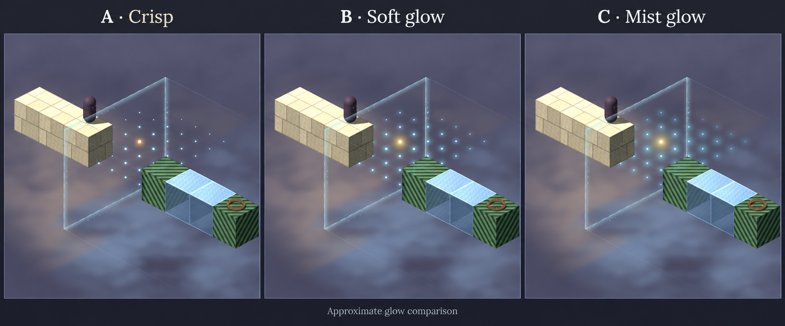
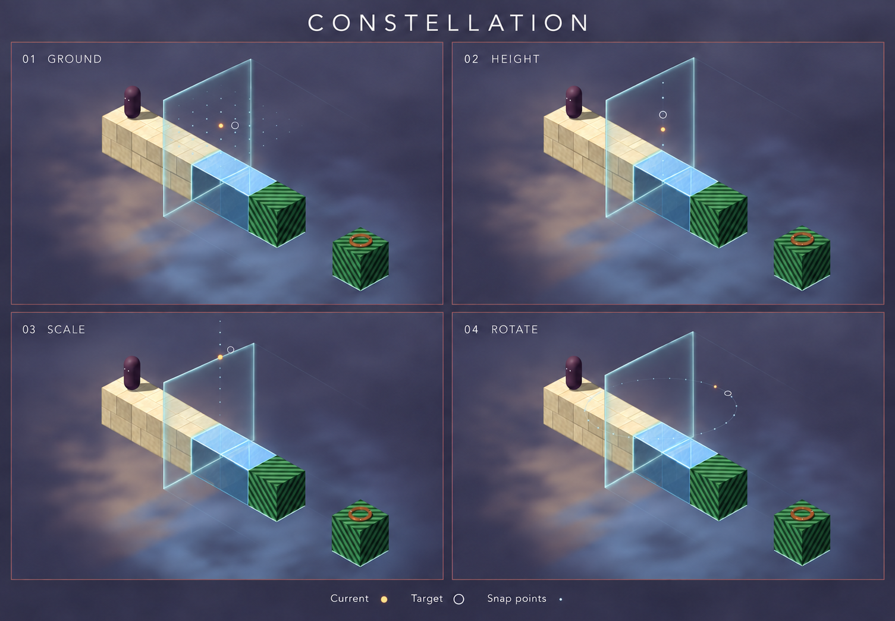

# Separate Mobile reference scene

See [the reference scene record](reference-scene.md) for the new standalone scene, native captures, and motion recording. The earlier Level 1 art remains in gameplay pending review.

## Little girl with long hair — Blender shape study

The [girl concept](traveller-girl-01.png) is the target for a separate simple Blender blockout. The user approved trying its long chestnut hair, visible face, hood, and blue-grey cloak in Blender. Shape approval is still pending. Keep the RiME-led rounded-face direction. See the [native blockout views and review](traveller-girl-blockout-01.md), [concept record](traveller-girl-01.md), and [Blender workflow](blender-workflow.md). Existing runtime assets remain unchanged.

## Earlier rounded traveller faces

The [rounded-face board](traveller-rounded-faces-01.png) follows the selected RiME direction, with Jusant as a secondary face-style reference. A — Gentle, B — Quiet, and C — Mature compare rounded face shapes with visible lids, a simple nose and mouth, and matte shading. Each has a bust and full-body view with the same blue-grey costume. Exact character, age, eye size, palette, and proportions remain proposals. The eyes in this board are still somewhat larger than the RiME reference.

Generated with the built-in image tool without image attachments. See the [prompt and review record](traveller-rounded-faces-01.md). This is a concept board, not a native render or an approved model sheet. No Blender or gameplay assets were changed.

## Earlier new traveller concepts

The [new concept board](traveller-new-concepts-01.png) starts from a visible face, hood, and cloak, without previous character image references. Rows compare A — Small wanderer, B — Slender traveller, and C — Grounded traveller. Column 1 has a simple stylised human face; column 2 has a minimal expressive face. Both have eyes and a mouth. Each matched pair keeps the same clothing, pose, and palette. Figure and face selection remain open. These are generated concepts, not Blender renders or an approved construction sheet.

The selected figure and face will receive front, side, back, three-quarter, and elevated game-camera views for approval before modeling. Keep current runtime assets intact until replacement approval. Approve a simple untextured model before adding materials or cloth motion. Earlier character targets no longer define the replacement design.

Generated with the built-in image tool; see the [prompt and review record](traveller-new-concepts-01.md). The rejected comparison board, its generated draft, duplicate generated output, and prompt record were deleted. No runtime, export, or game tests were run for this image study.

# Current trial — Ceramic B, porcelain R3, carved jade S1

The selected references are [ceramic-style-board.png](ceramic-style-board.png), [porcelain-reflection-board.png](porcelain-reflection-board.png), and [jade-absolute-board.png](jade-absolute-board.png). These boards were generated with the built-in image tool for appearance comparison. They are not runtime screenshots or exact level layouts.

Level 1 uses ivory ceramic with shallow arch relief, source-preserving porcelain reflections, carved jade, a thin metallic glass frame, and a compact dark traveller with a small pale oval and patterned hem. Fog is absent. Broad studio highlights and source-bound material coordinates keep moving and sliced surfaces stable. Cut caps remain opaque and plain. See [asset instructions](../../art_sources/README.md).

The implementation keeps exact collision boxes; rounded edges are a shading effect. It therefore does not reproduce the reference's rounded silhouette or baked soft lighting pixel for pixel. The character's hidden sides and hem animation are authored interpretations. Match and review the complete game at its normal camera scale before extending this treatment.

---

# Visual trial 01 — Earlier stage-spanning sheet

This is an earlier composition reference: **panel A** of [visual-trial-01.png](visual-trial-01.png), generated during the design discussion on 2026-09-08. Panel B is a comparison only.

The first art trial applies to **Level 1** after the camera and mirror mechanics pass. Match the reference's soft stone, warm daylight, cool night, smoky neutral background, restrained interface, and thin translucent sheet. Keep walkable surfaces readable from all four camera views.

The picture is a visual target. Its extra pillars and decorative cubes are not level instructions. The prototype retains its exact platforms, gaps, collision, goal, and reflection rules. Stone detail is procedural surface shading; the initial character remains a simple dark shape. The generated comparison remains unchanged as the reference.

Review the running level before extending the full treatment to the other puzzles and fixtures. Compare edit/play states, source-side marks, fall visibility, and phone/tablet layouts. Capture commands and actual test results are in the root README and VALIDATION documents.

## First in-game result

This is the first procedural material trial, not the final Blender art kit. The reference remains the target for later refinement of stone shapes and depth haze.

## Visual trial 02 — Earlier reflection concepts

[Comparison image](visual-trial-02.png), generated on 2026-09-08. Its Panel D remains an earlier approximate material reference. Its light-direction cue is not the current shader decision.

| Panel | Reflected material | Edge light points toward |
| --- | --- | --- |
| A | Solid stone | Original space |
| B | Solid stone | Reflected space |
| C | Holographic stone | Original space |
| D | Holographic stone | Reflected space |

The target is an immersive world with depth fog, detailed stone, a bounded translucent sheet, and minimal controls. No sun/moon meaning is assigned to the sides. Keep holographic walking tops clear and absolutes solid. The extra pillars and cubes are image-generation additions, not level changes. Existing mockups are approximate references.

## Constellation board 03 — selected B

**B: Soft glow** is selected. The brighter small cores have soft radial halos, strongest near the amber reference and weaker with distance. The image compares glow only; its dot positions are approximate. Runtime points stay on legal snap positions. Generated with the built-in image tool from the supplied game screenshot; prompt: preserve stage geometry and compare crisp, soft, and broad mist halos on a horizontal placement lattice.

## Constellation board 02 — earlier reference

This is an approximate generated reference for the passive Constellation guide. It shows subtle pearl-blue candidate dots, an amber current reference, and a hollow pearl target. The image does not define level geometry, touch regions, or camera framing.

## Second in-game result

Native Mac capture of the earlier procedural trial. The mirror emits a continuous ribbon along its perimeter toward reflected space. Walking tops remain clear while sides are transparent. Mist is made from world-space layers; this is not volumetric fog. The stage keeps its original geometry.

## Earlier compact-frame trial

Native Mac capture on 2026-09-08. This is an earlier approximate trial. Its fixed three-unit square frame and faint extension do not define the current bounded panel. Current mechanics use local edge resizing, world-space yaw and pitch orbs, smooth translation with release snapping, and a translucent fog ghost with two fading afterimages.

## Bounded mirror workshop

These native Mac captures are older mechanics references for the bounded workshop, not new art targets.

The bounded panel keeps side obstacles and reflects only its selected aperture. The world-space orbs follow its animated edge. Stone detail keeps its source coordinates through cuts.

## Mirror shader board 03 — Current edge light

[Panel D](mirror-shader-03.png) is the current shader target. It replaces the earlier flowing-wave treatment and is a visual reference only, not an in-game capture.

Use an almost-clear panel centre with a fixed world-unit soft perimeter. Keep rare slow particles at the edge only. Short ribbons point uniformly into reflected space. Measure perimeter light with an edge-distance field so corners do not brighten through additive overlap. Do not add bloom, volumetrics, scene distortion, or contour bands.

## Current bounded controls in game

Native Mac portrait capture on 2026-09-09. The tabs resize from fixed opposite edges; the round rotation orbs stay on the panel. This records the procedural edge-light implementation, not the generated target.

## Free movement and continuous rotation

Native Mac captures on 2026-09-09. Hollow knobs sit outside the frame; resize pills sit on its edges. Jade absolutes remain solid while reflected geometry follows the current angle. Final placement still uses quarter turns. These captures record the prototype, not a new generated art target.

## Direction and contact trial 04

`mirror-direction-contact-04.png` is the selected approximate B+C/E reference, made with the built-in image generator. Prompt: a bounded clear panel with an equal-perimeter one-sided light skirt, sparse outward motes, and a soft contact band crossing the top and side of one intact jade absolute. The image exaggerates light for readability. Runtime contact follows exact finite-panel intersections and never cuts an absolute. The earlier boards remain historical references.

Runtime review: `direction-contact-in-game.png` shows the earlier contrast correction on the jade contact seam and perimeter light; `placement-guide-in-game.png` shows the temporary ground reference. These are actual Mac Compatibility captures. The height control remains in its existing position and can cover part of a contact; moving it is deferred.

## Seam glow trial 05

`seam-glow-05.png` is a comparison made with the built-in image generator. **C: Mist glow** is selected. Prompt: compare a thin pearl contact seam with a narrow halo, soft surface glow, mist glow, and stronger contrast on jade and cream stone. Keep the object solid and show light across the top and side faces.

Use C for softness and colour only. Its mirror orientation is incorrect; runtime contours use the actual finite mirror plane and visible object faces. The wider surface band keeps a steady bright centre with slow, soft halo variation. It does not require bloom or volumetric fog.

## Prism guide trial 06

`prism-guides-06.png` is the selected revised **B: Soft ribbons** mockup, made with the built-in image generator. Prompt: retain B's scene and contact glow, reduce the four corner rays to faint, narrow pale blue-grey wisps with an earlier smooth fade, and keep platform contact light stronger. No filled prism faces or far cap.

This is an approximate visual reference. Runtime lines follow the four actual panel corners and reflected normal. Contact contours cover the panel and four side boundaries at any depth. The six-unit guide fade does not limit replacement or contact light.

## Native trial captures

- [Level 1](ceramic-trial-in-game.png)
- [Character close view](ceramic-character-in-game.png)
- [Fall preview](ceramic-fall-in-game.png)

These are Godot Compatibility viewport captures, not generated mockups.
