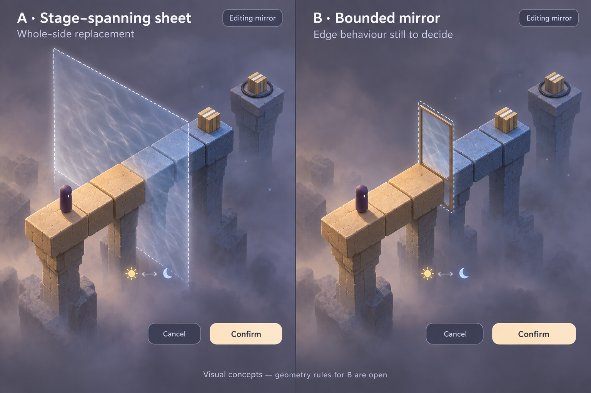
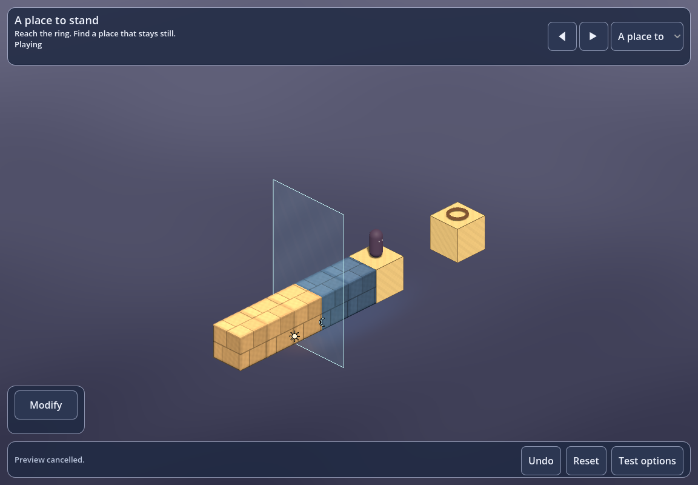

# Visual trial 01 — A stage-spanning sheet

Approved reference: **panel A** of [visual-trial-01.png](visual-trial-01.png), generated during the design discussion on 2026-09-08. Panel B is a comparison only.

The first art trial applies to **Level 1** after the camera and mirror mechanics pass. Match the reference's soft stone, warm daylight, cool night, smoky neutral background, restrained interface, and thin translucent sheet. Keep walkable surfaces readable from all four camera views.

The picture is a visual target. Its extra pillars and decorative cubes are not level instructions. The prototype retains its exact platforms, gaps, collision, goal, and reflection rules. Stone detail is procedural surface shading; the initial character remains a simple dark shape. The generated comparison remains unchanged as the reference.

Review the running level before extending the full treatment to the other puzzles and fixtures. Compare edit/play states, source-side marks, fall visibility, and phone/tablet layouts. Capture commands and actual test results are in the root README and VALIDATION documents.

## First in-game result

This is the first procedural material trial, not the final Blender art kit. The reference remains the target for later refinement of stone shapes and depth haze.
