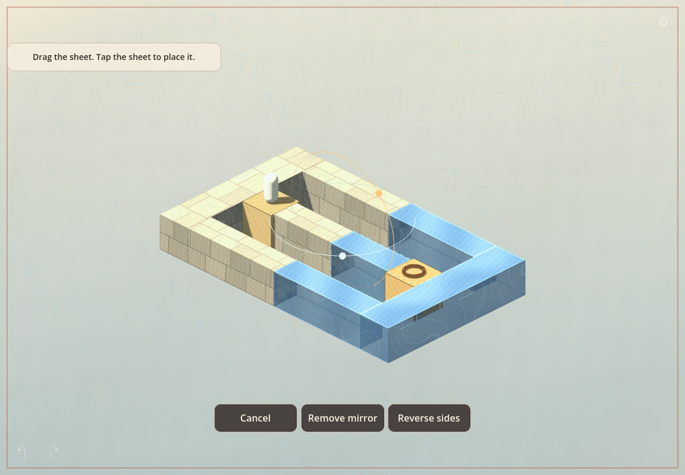

# Visual trial 01 — A stage-spanning sheet

Approved reference: **panel A** of [visual-trial-01.png](visual-trial-01.png), generated during the design discussion on 2026-09-08. Panel B is a comparison only.

The first art trial applies to **Level 1** after the camera and mirror mechanics pass. Match the reference's soft stone, warm daylight, cool night, smoky neutral background, restrained interface, and thin translucent sheet. Keep walkable surfaces readable from all four camera views.

The picture is a visual target. Its extra pillars and decorative cubes are not level instructions. The prototype retains its exact platforms, gaps, collision, goal, and reflection rules. Stone detail is procedural surface shading; the initial character remains a simple dark shape. The generated comparison remains unchanged as the reference.

Review the running level before extending the full treatment to the other puzzles and fixtures. Compare edit/play states, source-side marks, fall visibility, and phone/tablet layouts. Capture commands and actual test results are in the root README and VALIDATION documents.

## First in-game result

This is the first procedural material trial, not the final Blender art kit. The reference remains the target for later refinement of stone shapes and depth haze.

## Visual trial 02 — Reflection and edge-light concepts

[Comparison image](visual-trial-02.png), generated on 2026-09-08. Panel D is approved, with a correction: emit light evenly along all four perimeter edges toward reflected space. Do not copy the image’s concentrated spikes. This remains an approximate reference, not an in-game capture.

| Panel | Reflected material | Edge light points toward |
| --- | --- | --- |
| A | Solid stone | Original space |
| B | Solid stone | Reflected space |
| C | Holographic stone | Original space |
| D | Holographic stone | Reflected space |

The target is an immersive world with depth fog, detailed stone, a flowing translucent sheet, and minimal controls. No sun/moon meaning is assigned to the sides. Keep holographic walking tops clear and absolutes solid. The extra pillars and cubes are image-generation additions, not level changes. Directional light is an art cue, not a change to reflection rules. Both Full plane and Bounded column extent modes remain experimental; defer new art-direction mockups until the mechanics review. Existing mockups are approximate references.

## Second in-game result

Native Mac capture of the earlier procedural trial. The mirror emits a continuous ribbon along its perimeter toward reflected space. Walking tops remain clear while sides are transparent. Mist is made from world-space layers; this is not volumetric fog. The stage keeps its original geometry.

## Earlier compact-frame trial

Native Mac capture on 2026-09-08. This is an earlier approximate trial. The fixed three-unit square frame and faint extension do not define the current extent selector. Current mechanics use Full plane or Bounded column, world-space yaw and pitch rings, smooth translation with release snapping, and a translucent fog ghost with two fading afterimages. The D material and uniform reflected-side edge-light direction remain approximate art references.

## Mirror extent comparison

These native Mac captures show the same fixture and camera view. They are mechanics references, not a new art target.

Full plane affects the entire far side. Bounded column keeps the side obstacles and reflects only the selected aperture. The world-space rings have fixed radius; the panel dimensions are separate controls. Stone detail keeps its source coordinates through cuts. New art-style mockups follow the mechanics review.
