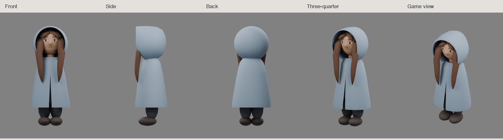

# Traveller girl — first Blender blockout

2026-09-13. **Rejected as the replacement character.** This shape study remains as a native Blender baseline. Its successful technical checks did not establish the required artistic quality. The next trial follows the [head construction reference](traveller-head-construction-01.md), with proportion approval required before modeling.



Editable source: [blockout.blend](../../art_sources/traveller_girl/blockout.blend). Construction: [blockout.py](../../art_sources/traveller_girl/blockout.py). Fixed cameras and lighting: [review.py](../../art_sources/traveller_girl/review.py).

The model has a rounded head with a face, a raised open hood, two long front hair masses, a plain cloak, trousers, and boots. Plain material colours separate these parts. The nose belongs to the head surface; eye and mouth details follow that surface. No textures, rig, cloth motion, or runtime replacement were added.

## Review result

Inspected front, side, back, three-quarter, and elevated game views in one live Blender session. Corrected the first build's detached hair strips, projecting eyes, wide cloak, hood rim, and overlapping rear hood caps. The final views show consistent geometry from the same scene.

The blockout is deliberately simpler than the concept. It still needs softer hood folds, a less rigid hair shape, more natural cheek and chin transitions, and a better shoulder connection. The pure side view hides the face behind the hood. Review this amount of coverage before detail work. Clothing has no sleeves or hand shapes yet. Do not treat this as a final match to the concept.

## Actual checks

- Official Blender Lab MCP: initialization, 26-tool inventory, live scene read, viewport screenshot, script execution, native render, and file save passed.
- Connection used `127.0.0.1:9876`; bridge auto-start is off. Stopped the bridge after review and left the saved study open in Blender.
- Python parse checks passed for both scripts.
- Blender repeat-build check passed: one character root, stable object and triangle counts, no numbered duplicate objects.
- 22 meshes, 5,182 triangles, 1.625-unit height. Cloak remains below 1,500 triangles; whole character remains below 8,000. No subdivision modifiers or textures.
- Existing Godot assets were not changed. No game tests, performance benchmark, exports, or device checks were run.

Open the saved file directly:

```sh
rtk proxy blender art_sources/traveller_girl/blockout.blend
```

To rebuild in a fresh Blender session, load `review.py` with `runpy.run_path()` and call `setup()`. It creates a separate scene and refuses to overwrite an open study. For an existing study, load `blockout.py` and call `build_character()` to replace only the study character. Save manual edits before rebuilding. See [connection instructions](blender-workflow.md) for live MCP use.
