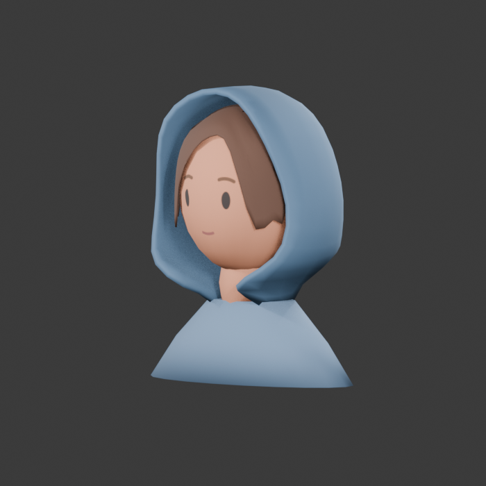

# Traveller hair study 02

## Confirmed comparison

Compare **Long**, **Bob**, and **Low bun** before full-body modeling. No hairstyle is selected as final. All three use the same painted face, chestnut palette, head, blue-grey hood, camera, and lighting.

The long style has broad locks below the shoulders. The bob ends near the chin. The low bun sits at the nape, with short cheek-length sections. Form the shallow side-swept fringe in the main scalp mesh, so it follows the forehead without a separate raised piece. Avoid a raised strip or separate blob. Side locks share vertices with the scalp in all three styles; their lower ends stay free. Long rear hair falls down the back in both hood poses and keeps its length. Keep the folded cloth compact rather than pushing the hair backward to clear it. Use [the supplied Link reference](traveller-simple-face-reference.png) and [Nintendo's character artwork](https://zelda.nintendo.com/links-awakening/characters/) for simple sculpted hair volumes, not separate thick blobs or detailed strands.

Use the [earlier rounded hood](traveller-hair-study-02/rounded-hood-target.jpg) as the shape target. Its bottom joins the cloak's top neckline. Do not extend the sides down to a lower shoulder attachment. Keep the neckline fixed in both hood poses. The face-opening edges end at separate left and right front-neck points. The lower cloth fit can vary by hairstyle: Long needs a larger rear opening, while Bob and Low bun close the unused lower gap. Keep the crown, main face-opening outline, and garment seam consistent. Fit the covered hair inside this hood with authored hair endpoints; the complete hairstyle remains visible with the hood lowered. Keep the long front sections visible through the opening. Do not use transparency or camera-dependent hiding to conceal clipping.

## Controls and model contract

Open `art_trial/painted_traveller_study.tscn`. **Hair / T** cycles the three styles. **Hood / U** changes the static hood pose. Face, blink, grey view, lighting, fixed views, and small view retain their existing controls. Changing hair preserves the selected expression and any active blink, hood pose, camera, lighting, and review scale. Reset returns to Long with a raised hood and neutral face.

Only the selected model is visible. The small study loads all three models once for direct comparison and uses their combined bounds, including deformation endpoints, for one stable camera fit. This viewer's resource use is not a final gameplay memory budget.

Each GLB has `Head`, `Hood`, and named `Hair*` nodes. `HoodLowered` is 0 for raised and 1 for lowered. Where a hair mesh needs adjustment, `HairTucked` is 1 for raised and 0 for lowered. Each style preserves its own topology between hood poses. The style variants do not need to share topology with each other. Expression tiles and material ownership remain as recorded in [study 01](traveller-painted-study-01.md).

The editable source contains named style collections, each with its own `Hood.Long`, `Hood.Bob`, or `Hood.Bun` source mesh. Each selected hood exports with the node name `Hood`. Each style exports a self-contained GLB using the same 1024×1024 atlas and at most two opaque materials. The approximate target is 3,000 triangles per bust, with a hard 5,000 ceiling. Runtime sources are the existing long GLB plus `traveller_painted_bob.glb` and `traveller_painted_bun.glb` under `assets/studies/`.

## Native comparison

`art_trial/hair_comparison.tscn` displays three hairstyle columns and two hood-pose rows with identical cameras and ceramic-scene lighting. These are live Godot models, not generated concept images. Fixed front, side, back, three-quarter, and elevated captures support the review.

## Validation

Current Blender evidence covers **side, rear, and three-quarter views** for all three styles in both poses. Raised examples: [Bob side](traveller-hair-study-02/bob/raised/side.png), [Low bun](traveller-hair-study-02/bun/raised/three-quarter.png), and [Long rear opening](traveller-hair-study-02/long/raised/back.png). Lowered examples: [Long side](traveller-hair-study-02/long/lowered/side.png) and [Low bun](traveller-hair-study-02/bun/lowered/three-quarter.png). Front and elevated Blender images still show the preceding hood revision.

The current native Mobile/Metal review covers [three-quarter](traveller-hair-study-02/native/hood-cloak-three-quarter.png), [side](traveller-hair-study-02/native/hood-cloak-side.png), and [rear](traveller-hair-study-02/native/hood-cloak-back.png) views of all three styles in both poses. It confirms that Bob and Low bun no longer have an exposed throat band or hanging rear point. Long keeps the larger hair exit and the same full-length rear hair.

| Complete bust | Triangles | Opaque materials | Colour atlas |
| --- | ---: | ---: | --- |
| Long | 4,196 | 2 | 1024×1024 |
| Bob | 4,300 | 2 | 1024×1024 |
| Low bun | 4,496 | 2 | 1024×1024 |

The lower opening is part of the coarse hood cage. Its two front ends join the garment separately; there is no cloth edge across the throat. Bob and Low bun have broad lower side and rear cloth that rounds into the neckline. Long keeps a larger rear and side exit for its existing hair. The hood and garment remain separate meshes. Each hood has 38 fixed seam vertices spanning 0.594 units across the neckline. The maximum distance from those vertices to the garment surface is 0.045 units for Long and 0.030 units for Bob and Low bun; the seam is embedded in the garment top.

The focused Blender checks passed for all six style/pose combinations. They found no hair/head, hair/hood, or hood/head crossings. Each hood is one connected, closed shell, with no open edges or collapsed base faces. Each seam spans both neckline sides, has adjacent seam vertices, and stays fixed between poses. All three scalp meshes remain closed surfaces with shared side-lock roots. Long rear hair retains a root-to-tip path of 1.679 units in both poses, with no tip-height change.

An exact comparison against the preceding editable source confirmed unchanged vertex coordinates, both hair pose coordinates, face connectivity, root groups, and object transforms for all four hair meshes. The separate fringe and side-lock meshes remain removed. The GLB checks confirmed one `Hood` node per model, equal vertex counts between hood poses, two opaque materials, one shared atlas, and the triangle counts above.

The current asset passed **137 focused Godot checks, 0 failures**. The current native review used Godot 4.7.2, Mobile rendering through Metal, on a Mac with an M2 Pro. Clothing approval remains with the user. The older [native three-quarter](traveller-hair-study-02/native/connected-locks-three-quarter.png), [side](traveller-hair-study-02/native/connected-locks-side.png), and [rear](traveller-hair-study-02/native/connected-locks-back.png) boards document the connected hair before this hood fit.

The current Blender work uses 5.2.1. It covers static endpoints only. Full-body modeling, the hood transition, hair animation, physical-device validation, and gameplay replacement remain later work after approval.

## Editable files

- [Blender source](../../art_sources/traveller_painted/traveller_painted_study.blend): named Long, Bob, and Bun collections, with the atlas packed into the file.
- [Builder](../../art_sources/traveller_painted/build_study.py): recreates the source, three GLBs, and fixed Blender captures in a separate background process.
- [Clearance check](../../art_sources/traveller_painted/check_clearance.py): checks each style’s hair clearance in both endpoints, hood/head clearance, a broad fixed garment seam, and a connected closed hood shell. Narrow point attachments fail the seam-width check.

Run the builder with Blender's `--background --factory-startup --python-exit-code 1 --python` options. Run the clearance check with the resulting blend file loaded, also in background mode. Keep documentation images and editable art sources outside game exports.
