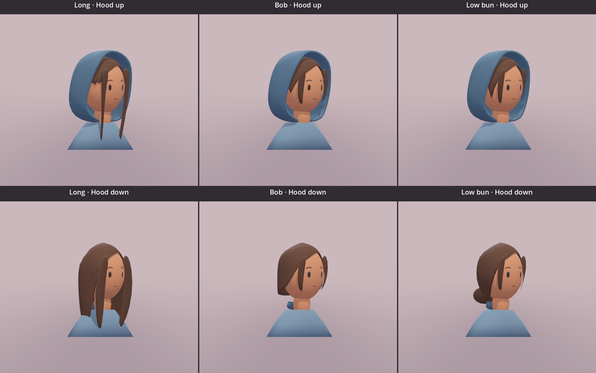

# Traveller hair study 02

## Confirmed comparison

Compare **Long**, **Bob**, and **Low bun** before full-body modeling. No hairstyle is selected as final. All three use the same painted face, chestnut palette, head, blue-grey hood, camera, and lighting.

The long style has broad locks below the shoulders. The bob ends near the chin. The low bun sits at the nape, with short cheek-length sections. Form the shallow side-swept fringe in the main scalp mesh, so it follows the forehead without a separate raised piece. Avoid a raised strip or separate blob. Long hair should fall mainly downward with the hood lowered. Keep the folded cloth compact rather than pushing the hair backward to clear it. Use [the supplied Link reference](traveller-simple-face-reference.png) and [Nintendo's character artwork](https://zelda.nintendo.com/links-awakening/characters/) for simple sculpted hair volumes, not separate thick blobs or detailed strands.

Use the [earlier rounded hood](traveller-hair-study-02/rounded-hood-target.jpg) as the shape target. Its bottom joins the cloak's top neckline. Do not extend the sides down to a lower shoulder attachment. Keep the neckline fixed in both hood poses. Fit the covered hair inside this hood with authored hair endpoints; the complete hairstyle remains visible with the hood lowered. Keep the long front sections visible through the opening. Do not use transparency or camera-dependent hiding to conceal clipping.

## Controls and model contract

Open `art_trial/painted_traveller_study.tscn`. **Hair / T** cycles the three styles. **Hood / U** changes the static hood pose. Face, blink, grey view, lighting, fixed views, and small view retain their existing controls. Changing hair preserves the selected expression and any active blink, hood pose, camera, lighting, and review scale. Reset returns to Long with a raised hood and neutral face.

Only the selected model is visible. The small study loads all three models once for direct comparison and uses their combined bounds, including deformation endpoints, for one stable camera fit. This viewer's resource use is not a final gameplay memory budget.

Each GLB has `Head`, `Hood`, and named `Hair*` nodes. `HoodLowered` is 0 for raised and 1 for lowered. Where a hair mesh needs adjustment, `HairTucked` is 1 for raised and 0 for lowered. Each style preserves its own topology between hood poses. The style variants do not need to share topology with each other. Expression tiles and material ownership remain as recorded in [study 01](traveller-painted-study-01.md).

The editable source contains named style collections. Each style exports a self-contained GLB using the same 1024×1024 atlas and at most two opaque materials. The approximate target is 3,000 triangles per bust, with a hard 5,000 ceiling. Runtime sources are the existing long GLB plus `traveller_painted_bob.glb` and `traveller_painted_bun.glb` under `assets/studies/`.

## Native comparison

`art_trial/hair_comparison.tscn` displays three hairstyle columns and two hood-pose rows with identical cameras and ceramic-scene lighting. These are live Godot models, not generated concept images. Fixed front, side, back, three-quarter, and elevated captures support the review.

## Validation

[Side view of the revised hair](traveller-hair-study-02/native/flush-fringe-side.png).

Earlier hair-comparison captures, before the hood connection repair: [front](traveller-hair-study-02/native/front.png), [side](traveller-hair-study-02/native/side.png), [back](traveller-hair-study-02/native/back.png), [elevated](traveller-hair-study-02/native/elevated.png), [small review size](traveller-hair-study-02/native/small.png), and [study controls](traveller-hair-study-02/native/controls.png).

| Complete bust | Triangles | Opaque materials | Colour atlas |
| --- | ---: | ---: | --- |
| Long | 3,652 | 2 | 1024×1024 |
| Bob | 3,588 | 2 | 1024×1024 |
| Low bun | 3,784 | 2 | 1024×1024 |

The raised hood uses the earlier rounded cage. Its low rear edge meets the top neckline instead of extending to the lower shoulders. The attachment check confirms one connected hood mesh and three fixed contact vertices within 0.0092 units of the garment surface. It also rejects attachments below the neckline. The hood and garment remain separate meshes in this bust study.

Covered rear hair gathers inside the raised hood. With the hood lowered, the long rear hair falls mainly downward. The cloth forms a small fold behind the neckline, inside the hair clearance area; the hair does not flare outward around it. The bun sits above the fold. The front locks keep their separate tucked endpoint. The separate HoodSeat piece remains removed. These are authored static poses; the future hood transition still needs a full-body rig and clearance review.

The focused Godot study checks passed: **179 checks, 0 failures**. The check count is lower because the six separate fringe meshes were removed; the test code is unchanged. The checks cover selection, one visible style, pose restoration, preserved expression and blink state, stable camera settings, instance material ownership, and asset limits. Blender checks evaluated all 10 hair meshes in world space against the head and hood in both poses, with no detected crossings or hair vertices inside the head.

Native review uses Godot 4.7.2, Mobile rendering through Metal, on a Mac with an M2 Pro. The original review covered all five views. The fringe and long-hair correction was checked in native side and three-quarter boards for all three styles and both poses. These are static endpoint checks, not proof of clearance during a future hood animation. No physical-device performance claim is made.

Full-body modeling, the hood transition, hair animation, and gameplay replacement remain later work after hairstyle approval.

The small elevated review keeps the face readable, but hairstyle differences are less clear with the hood raised. The earlier input review checked T and U; this repair used the six-model comparison board. The runtime stopped with no reported errors; its temporary bridge was removed. The builder reports a Blender warning about Material.use_nodes becoming obsolete in Blender 6.0; the current Blender 5.2.1 build and exports completed successfully.

## Editable files

- [Blender source](../../art_sources/traveller_painted/traveller_painted_study.blend): named Long, Bob, and Bun collections, with the atlas packed into the file.
- [Builder](../../art_sources/traveller_painted/build_study.py): recreates the source, three GLBs, and fixed Blender captures in a separate background process.
- [Clearance check](../../art_sources/traveller_painted/check_clearance.py): checks hair clearance in both endpoints, a fixed garment seam, and connected hood geometry. The former detached model fails the attachment check.

Run the builder with Blender's `--background --factory-startup --python-exit-code 1 --python` options. Run the clearance check with the resulting blend file loaded, also in background mode. Keep documentation images and editable art sources outside game exports.
