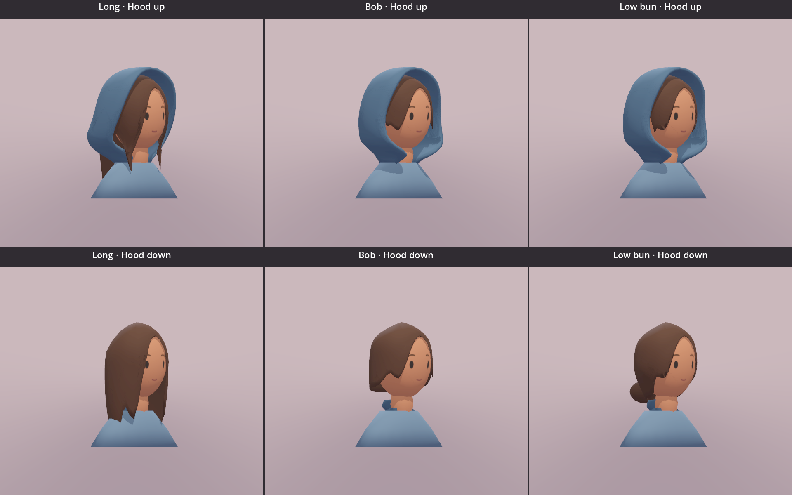

# Traveller hair study 02

This bust study is now an appearance reference only. The [new full-body low-bun study](traveller-full-01.md) replaces further hood repairs here. Its hood must fold with retained cloth area; the old endpoint compression is not a construction reference. Existing assets remain saved for comparison.

## Confirmed comparison

Compare **Long**, **Bob**, and **Low bun** before full-body modeling. No hairstyle is selected as final. All three use the same painted face, chestnut palette, head, blue-grey hood, camera, and lighting.

The long style has broad locks below the shoulders. The bob ends near the chin. The low bun sits at the nape, with short cheek-length sections. Form the shallow side-swept fringe in the main scalp mesh, so it follows the forehead without a separate raised piece. Avoid a raised strip or separate blob. Side locks share vertices with the scalp in all three styles; their lower ends stay free. Long rear hair falls down the back in both hood poses and keeps its length. Keep the folded cloth compact rather than pushing the hair backward to clear it. Use [the supplied Link reference](traveller-simple-face-reference.png) and [Nintendo's character artwork](https://zelda.nintendo.com/links-awakening/characters/) for simple sculpted hair volumes, not separate thick blobs or detailed strands.

Use the [earlier rounded hood](traveller-hair-study-02/rounded-hood-target.jpg) as the shape target. Its bottom joins the cloak's top neckline. Do not extend the sides down to a lower shoulder attachment. Keep the neckline fixed in both hood poses. The face-opening edges end at separate left and right front-neck points. The lower cloth fit can vary by hairstyle: Long needs a larger rear opening, while Bob and Low bun close the unused lower gap. Keep the crown, main face-opening outline, and garment seam consistent. Fit the covered hair inside this hood with authored hair endpoints; the complete hairstyle remains visible with the hood lowered. Keep the long front sections visible through the opening. Do not use transparency or camera-dependent hiding to conceal clipping.

The Long hood must retain broad side cloth into the neckline. Its rear hair exit must not remove the visible side panels. Small local bends in the raised `HairTucked` pose are allowed to fit the front locks through the face opening and the rear hair through the nape opening. Preserve the lowered pose, connected roots, and tip heights. Front-lock and rear-hair path lengths may change by at most 2% from the preceding study. Use directly authored cloth boundaries instead of successive cage-point repairs or broad face-removal exceptions.

## Controls and model contract

Open `art_trial/painted_traveller_study.tscn`. **Hair / T** cycles the three styles. **Hood / U** changes the static hood pose. Face, blink, grey view, lighting, fixed views, and small view retain their existing controls. Changing hair preserves the selected expression and any active blink, hood pose, camera, lighting, and review scale. Reset returns to Long with a raised hood and neutral face.

Only the selected model is visible. The small study loads all three models once for direct comparison and uses their combined bounds, including deformation endpoints, for one stable camera fit. This viewer's resource use is not a final gameplay memory budget.

Each GLB has `Head`, `Hood`, and named `Hair*` nodes. `HoodLowered` is 0 for raised and 1 for lowered. Where a hair mesh needs adjustment, `HairTucked` is 1 for raised and 0 for lowered. Each style preserves its own topology between hood poses. The style variants do not need to share topology with each other. Expression tiles and material ownership remain as recorded in [study 01](traveller-painted-study-01.md).

The editable source contains named style collections, each with its own `Hood.Long`, `Hood.Bob`, or `Hood.Bun` source mesh. Each selected hood exports with the node name `Hood`. Each style exports a self-contained GLB using the same 1024×1024 atlas and at most two opaque materials. The approximate target is 3,000 triangles per bust, with a hard 5,000 ceiling. Runtime sources are the existing long GLB plus `traveller_painted_bob.glb` and `traveller_painted_bun.glb` under `assets/studies/`.

## Native comparison

`art_trial/hair_comparison.tscn` displays three hairstyle columns and two hood-pose rows with identical cameras and ceramic-scene lighting. These are live Godot models, not generated concept images. Fixed front, side, back, three-quarter, and elevated captures support the review.

## Validation

Current Blender evidence covers front, side, rear, three-quarter, and elevated views for all three styles in both poses. Raised examples: [Long side](traveller-hair-study-02/long/raised/side.png), [Long three-quarter](traveller-hair-study-02/long/raised/three-quarter.png), and [Long rear opening](traveller-hair-study-02/long/raised/back.png).

The current native Mobile/Metal review covers [three-quarter](traveller-hair-study-02/native/clean-long-three-quarter.png), [side](traveller-hair-study-02/native/clean-long-side.png), and [rear](traveller-hair-study-02/native/clean-long-back.png) views of all three styles in both poses. Long now has broad cloth into the neckline and a finished rear exit, without the previous thin connector strips. Bob and Low bun retain their previous shape.

| Complete bust | Triangles | Opaque materials | Colour atlas |
| --- | ---: | ---: | --- |
| Long | 4,276 | 2 | 1024×1024 |
| Bob | 4,300 | 2 | 1024×1024 |
| Low bun | 4,496 | 2 | 1024×1024 |

The hood uses directly authored cage rows and explicit face and rear opening boundaries. The sequential point overrides and broad Long face-removal exceptions are removed. Its two front ends join the garment separately; there is no cloth edge across the throat. The hood and garment remain separate meshes. Each hood has 38 fixed seam vertices spanning 0.594 units across the neckline, within 0.030 units of the garment surface.

The focused Blender checks passed for all six style/pose combinations. They found no hair/head, hair/hood, or hood/head crossings. Each hood is one connected, closed shell with a fixed seam. All three scalp meshes retain connected side-lock roots. Against source commit `84d513a`, the Long front-lock paths are unchanged and the rear path changes by −0.57%. Root positions and tip heights are fixed. The outer Long hair surface has no detected self-crossings in either pose.

Long's lowered hair coordinates remain exact. Bob and Low bun hair coordinates are unchanged; their hood coordinates differ by less than 0.00000007 units after writing the cage rows directly. Long's raised pose uses an ordered route around the lower cloth. The GLBs retain one `Hood` node each, matching pose vertex counts, the existing controls, two opaque materials, and one shared atlas.

The hidden inner hair shell is not fully free of self-overlap. A diagnostic found 631 overlapping face pairs in the saved Long candidate, compared with 779 in `84d513a`; these counts do not indicate visible outer-surface crossings. Full inner-shell cleanup is not established by the static clearance checks.

Pending fit decision: the saved candidate moves the lower rear curtain slightly backward at fixed tip heights. A strict fade to the original lower positions puts all 54 source vertices below z=1.2 inside the cloak body and hides the hair ends. The centre tip moves from y=0.4325 to y=0.6000 in the saved candidate. A choice between this lower-hair fit and a cloak-body change is pending; the full lower-fade requirement is not complete. Failed subdivision and fade experiments are excluded from the saved study.

The current asset passed **137 focused Godot checks, 0 failures**. The current native review used Godot 4.7.2, Mobile rendering through Metal, on a Mac with an M2 Pro. Clothing approval remains with the user. The older [native three-quarter](traveller-hair-study-02/native/connected-locks-three-quarter.png), [side](traveller-hair-study-02/native/connected-locks-side.png), and [rear](traveller-hair-study-02/native/connected-locks-back.png) boards document the connected hair before this hood fit.

The current Blender work uses 5.2.1. It covers static endpoints only. Full-body modeling, the hood transition, hair animation, physical-device validation, and gameplay replacement remain later work after approval.

## Editable files

- [Blender source](../../art_sources/traveller_painted/traveller_painted_study.blend): named Long, Bob, and Bun collections, with the atlas packed into the file.
- [Builder](../../art_sources/traveller_painted/build_study.py): recreates the source, three GLBs, and fixed Blender captures in a separate background process.
- [Clearance check](../../art_sources/traveller_painted/check_clearance.py): checks each style’s hair clearance in both endpoints, hood/head clearance, a broad fixed garment seam, and a connected closed hood shell. Narrow point attachments fail the seam-width check.

Run the builder with Blender's `--background --factory-startup --python-exit-code 1 --python` options. Run the clearance check with the resulting blend file loaded, also in background mode. Keep documentation images and editable art sources outside game exports.
