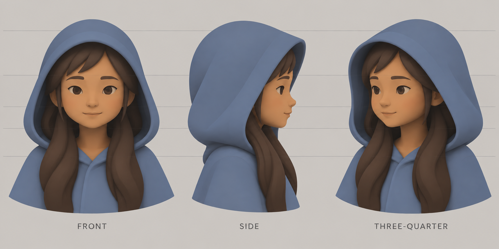

# Traveller head construction 01

2026-09-13. **Proportion approval pending.** This is a generated design reference, not a Blender render or proof of model quality.

## Appearance proposed for approval

The [girl concept](traveller-girl-01.png) supplies the identity and palette: a child with a visible face, long chestnut hair, and a raised blue-grey hood connected to a cloak. This sheet proposes smaller eyes, broad hair masses, plain cloth, and quiet painted colour. Exact age remains unspecified.

The front, side, and three-quarter views show the same proposed head at similar scale. The face has cheeks, a small nose, a chin, and a small mouth inside the hood opening. The hood covers the skull and hair and drapes toward the shoulders. Long locks pass in front of the cloak.

The second generation removes fine cloth grain and hair grooves from the first draft. Inspect proportions before modeling. The sheet is not a measured orthographic projection: use its guides as visual aids, then reconcile small view differences in the actual 3D mesh. The covered skull and rear hair still need construction in Blender. The three-quarter view faces left; the side view faces right. They show opposite sides, not a required turn direction.

## Confirmed trial

Use one Astra modeling worker at xhigh effort, with the main Astra agent owning the brief, native visual review, and Godot integration. Use Blender native tools and the installed official Blender Lab MCP. An official CC0 base mesh is allowed. No cloud generator, paid asset, or new add-on is part of this trial.

1. Approve these proportions.
2. Build a separate simple head, hood, hair, neck, and shoulder study. Review grey geometry in front, side, back, three-quarter, and elevated views before adding materials.
3. After shape approval, author UVs and painted colour. Target at most 5,000 triangles, one 1024-square colour atlas, and at most three opaque material surfaces. Add roughness only if useful.
4. Check a blink and a small head turn. Review the textured asset in Godot Mobile under neutral and ceramic-scene lighting, at close and game size.
5. Deliver editable Blender source, packed textures, GLB, native captures, and a short turntable. Existing runtime assets stay intact until replacement approval.

This stage completed image generation and visual inspection only. Official base-mesh preparation is recorded separately in [the base review](traveller-head-base-review.md). No replacement model, rig, texture atlas, or Godot result is claimed yet. Do not update global modeling delegation rules or adopt a project skill until the user confirms a better native result.

## Generation record

Tool: built-in image generation. Source reference: `docs/art/traveller-girl-01.png`. One initial sheet and one focused simplification pass. Only the refined sheet is the project-bound review artifact; the generated draft remains outside the project.

### Initial prompt

Use case: stylized-concept. Asset type: character CONSTRUCTION reference for a simple stylized 3D game head, not a game screenshot.
Input image 1: identity and palette reference only, the little girl with long chestnut hair and blue-grey hood. Simplify it for an elegant small game character while keeping her identity.
Create a wide single sheet with THREE equally scaled bust views of exactly the same girl: FRONT orthographic looking straight at camera; SIDE orthographic facing right in exact profile; THREE-QUARTER facing right at 45 degrees. All cameras at eye height, no camera tilt, no varying perspective. Align top of skull, eyebrows, nose base, chin and shoulders across the sheet using very fine pale horizontal guides. Label only FRONT, SIDE, THREE-QUARTER below the respective views.
Show from hood crown to mid chest, enough to understand hood joining cloak at shoulders and long hair falling beyond chest. Plain light warm grey background. Broad matte soft illustration shading, readable simplified contours and planes, subtle painted color fields rather than realistic textures. No pores, fabric weave, hair strands, glossy eyes, render speckles, or background story elements.
Girl is a child with rounded but not inflated cheeks, short nose, small chin, moderately small almond-shaped eyes with upper eyelids and restrained dark irises, visible small nose volume and a quiet small mouth. Eyes should be a little smaller than the reference, no exaggerated cartoon eyeballs. Keep a head-shaped face with real cheeks and jaw, never a floating mask or attached disc. No new facial accessories.
Hood: simple muted blue-grey cloth shell fitting over skull and hair, with visible thickness along its open front rim, modest round crown, a soft rear drape and shoulder attachment, not a helmet or rigid circular tube. Make the side view show that the nose and cheek lie inside the opening, hood rim framing temple without covering the whole face. It should read as cloth in all views.
Hair: chestnut broad solid masses; simple side swept fringe, two long soft locks in front of cloak plus rear hair mass tucked under hood. Two or three broad surface planes per lock; do not draw thin grooves or individual strands. Keep same fringe side and part position in every view. Ensure the near eye in profile is on the side of the head, far eye absent in exact side profile, features consistently follow head direction.
Cloak neckline is modest simple overlapping blue-grey fabric, no clasp, badges, trim, decorations or elaborate folds. No added props. Maintain consistent head/face/skull width and depth between views. The construction must be plausible as the same 3D mesh rotating, not three different designs.

### Refinement prompt

Edit the supplied three-view character construction sheet. Preserve the girl's identity, hood contour, facial perspective, camera angles, alignment, pose, layout, labels, colors, broad hair lock shapes and clothing construction. Change ONLY the visual simplification: make the eyes about 15 percent smaller without changing their centers; keep soft eyelids and restrained dark irises with no glossy bright sparkles. Remove all fabric grain, hair strand lines, fine streaks and surface noise. Use large quiet painted color areas, smooth simple sculptural forms, a little warm cheek color, and two or three broad soft shading values. Give each hair mass one broad low-contrast painted highlight rather than many grooves. Simplify lip modeling into a small subtle mouth line without makeup. Reduce realism but avoid caricature, anime, huge eyes, sharp cel bands and thick outlines. Result should be an artistically simple soft illustration construction sheet that a low-poly stylized game model can match. Keep the SIDE as strict profile, FRONT as straight-on, THREE-QUARTER as rotated view of same head. No new decorations, objects, notes or accessories.

