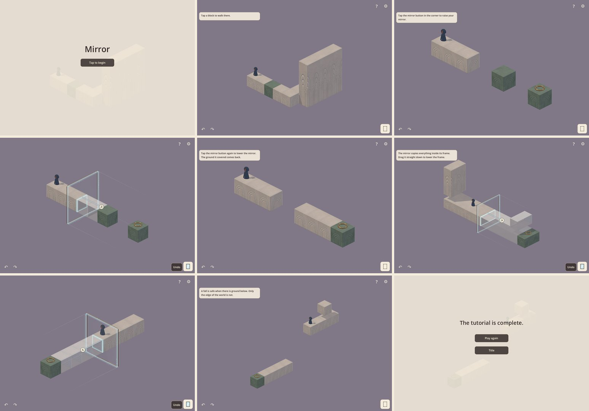

# Polish gap: from the tutorial MVP to a published puzzle game

Written 2026-10-06, at commit `3580a37`. The owner wants the game to reach the
polish of published games in its genre, with Monument Valley as the
reference. This document records the bar, where the game stands, and the gap
between them, before any work to close it. Update it as gaps close. Keep
decisions in `GAME_DESIGN.md`.

## In one paragraph

Today the game is a well-engineered rules prototype: a new mirror rule,
about 5,000 automated checks, and a ceramic block set. It is not yet a game
a stranger would play for pleasure. It has six one-minute tutorial stages
made of a few floating cubes, no story, no world around the stages, one walk
animation, generated placeholder audio, and text cards for guidance. Reaching
the bar takes, in order: one idea that unites story, world and mechanic; a
world in which every screen is a composed picture; levels with depth and
set pieces; teaching without words; and feedback that makes every action
feel good. The largest gaps are story, world art and level content. The most
urgent gap is cheap to close: no player has tried the game yet.

## The bar

*Being written: the benchmark facts, with sources, are still being gathered.*
<!-- BAR -->

## Where we are

*The title, the six stages (stages 2, 4 and 5 mid-solution) and the end
card. Captured through the app with the Mobile renderer on Linux software
Vulkan, at 1152×800.*

| Area | Today |
| --- | --- |
| Content | 6 tutorial stages of 3 to 10 blocks, mostly single rows 6 to 12 units long, each solved with at most five mirror actions. About 5 to 10 minutes in all; no player has been timed. 9 developer fixtures. |
| Mechanics | Walk, turn the view, one mirror (raise or lower, slide on three axes, point four ways), jade blocks that never change, and falls (safe onto ground, fatal off the world). No other interactive objects. |
| Story | None in the game. Three candidate directions in `GAME_DESIGN.md`, none chosen. The goal is a bronze ring with no meaning in the world. |
| Guidance | 12 prompt sentences (111 words) on a text card, and a **?** button that replays them. No visual or idle hints. Nothing says who the traveller is or why they travel. |
| World and art | One ceramic block set: ivory originals, porcelain copies, jade. A flat mauve background with no ground, horizon, scenery, props or lighting moods. A stage covers about a third of a 1152×800 window, and 14 to 24 percent of a phone screen in portrait. The traveller is 51 to 87 pixels tall on that window, and 29 to 37 on the phone. |
| Character | One model (4,992 triangles) with one animation in play: walk. No idle, reaction, interaction, fall, landing or celebration. The hood clips cannot ship, because the arms pass through the cloak. |
| Feel | Copies appear with a 0.1-second ease. The stage sweep, the fall ghost and the contact glow exist. Little else moves. |
| Controls | The direct controls trial, not yet tried by players. |
| Audio | One 30-second mono ambient loop and ten short effects, all generated by a script. No composed or adaptive music, and no haptics. |
| UI and menus | A title (the word "Mirror", Tap to begin, New game), a HUD (gear, **?**, Undo, mirror button, desktop view arrows), settings (music, effects, fullscreen), and an end card ("The tutorial is complete."). No chapter select, pause screen, credits or photo mode. |
| Platforms | Checked natively on a Mac (Apple M2 Pro). iPhone and iPad only briefly in early trials; Android never. Export presets for macOS and iOS only. No store build; phone performance not measured. |
| Accessibility and languages | English only, with text hard-coded. No text size, reduced motion or haptics options. Jade differs from ivory in pattern as well as colour. |

Keep these; published games are built on the same things:

- **The mirror rule.** Copying what one side of a bounded panel holds onto
  the other, with jade blocks that never change, is new, deep and readable.
  It is the game's hook.
- **A tested rules engine.** About 5,000 automated checks, and a
  solvability harness that proves each stage's solution and its near misses.
- **A material identity.** Ivory ceramic, cool porcelain copies and carved
  jade read as one family, and they do not imitate Monument Valley's flat
  pastel look.
- **An original character** with an editable Blender source and a working
  path into the game.
- **The basics of a product:** save and resume, settings, a release mode,
  the stage sweep, and the direct controls prototype.

## The gap, area by area

Sizes are relative, for one person working with agents: **S** is days,
**M** is weeks, **L** is one to three months, **XL** is more. They are rough,
and they will change once the first decisions are made.

| # | Area | The gap | Size | Waits on |
| --- | --- | --- | --- | --- |
| 1 | Identity and story | No premise, world, characters or ending | XL | your decisions |
| 2 | A player-tested core | No player has tried the game | M | — |
| 3 | Levels and content | 6 one-minute stages against hours of deep levels | XL | 1, 2, 4, 5 |
| 4 | Mechanic variety | One mirror; the next elements are undecided | L | 2 |
| 5 | World and level art | Cubes in a void against composed, themed dioramas | XL | 1 |
| 6 | Character | One walk; small on screen | L | 1, 5 |
| 7 | Feel | Near-instant changes; few animations | L | 5 |
| 8 | Guidance | Text cards against wordless teaching | M | 2, 3 |
| 9 | Audio and music | Generated placeholders | L | 1, 5 |
| 10 | UI and menus | A bare title and end card; no chapter select | M | 1, 5 |
| 11 | Platforms and release | Mac only; no store build | L | — |
| 12 | Accessibility and languages | None | M | 8, 10 |
| 13 | Production | No art, music or playtest pipeline | — | your decisions |

### 1. Identity and story — XL

- **Today:** a title, a traveller and a rule, but no premise. The player is
  not told who they are, where they are, or why they cross. The goal is a
  ring on a jade block. `GAME_DESIGN.md` lists three directions (belonging,
  possible lives, loss and acceptance) and a workshop concept; none is
  chosen.
- **The bar:** the mechanic, the world and the story are one idea, told
  mostly through the environment, with an emotional ending (see "The bar",
  1 and 2).
- **To close:** choose a direction. Write a one-page premise: who, where,
  why, what changes, how it ends. Decide what the mirror is in the world and
  what the goal is. Outline the chapters so each story beat meets a mechanic
  beat. Decide how the story is told: wordless, chapter cards, or a few
  lines. The mirror carries strong themes on its own: reflection, the other
  side, what could have been, repair.

### 2. A player-tested core — M

- **Today:** no one outside development has played. The direct controls are
  untried; the classic editor felt like Blender to you.
- **The bar:** the core is proven with strangers before content is made at
  scale.
- **To close:** five first-time players on the six stages, on a phone and on
  a Mac, watched and not helped. Note where each one stalls, fix the
  controls and the teaching, and repeat. This is cheap, and it lowers the
  risk of everything after it.

### 3. Levels and content — XL

- **Today:** six stages, each a short row of blocks solved with at most
  five mirror actions, about a minute each. Levels are JSON lists of axis-aligned boxes:
  no props, no shapes other than boxes, no decoration, no moving parts.
- **The bar:** a complete game of an hour and a half or more, in which each
  level is a distinct place with its own idea, several interactions and a
  set-piece moment, and in which the mechanics recombine as the difficulty
  rises (see "The bar", 3).
- **To close:** a level framework (each chapter introduces, explores, twists
  and ends on a set piece). The content target follows from the scope you
  choose: roughly 10 to 15 substantial levels of 5 to 10 minutes for a
  90-minute game. Hand-written JSON boxes cannot make dioramas, so levels
  need an authoring path that adds art dressing on top of the gameplay
  boxes, such as a Godot scene layer. Extend the solvability harness to
  every level.

### 4. Mechanic variety — L

- **Today:** one mirror, jade, and falls. Tilt is unproven. A second mirror,
  switches, keys, doors and ladders are undecided.
- **The bar:** a new element or twist in most chapters, each introduced
  alone and then combined (see "The bar", 3).
- **To close:** a mechanic roadmap of about one new element per chapter.
  Prototype each one as a fixture and play it before any art is made. The
  design record already has candidates: tilt (copying upward), a second
  mirror, objects that share state across the plane, and a companion or
  other characters.

### 5. World and level art — XL

- **Today:** one block set and a goal ring in a flat mauve void. No ground,
  sky, horizon, props, water, plants, life or lighting moods. Stages are
  small on screen.
- **The bar:** every screen composed like an illustration, with a strong
  silhouette per level, a palette per chapter, a backdrop, architectural
  detail and ambient motion (see "The bar", 4).
- **To close:** an art direction bible (concept paintings, a palette and
  lighting per chapter, an architecture vocabulary that grows from the
  ceramic identity); a modular kit beyond cubes (stairs, arches, columns,
  roofs, doors, ornaments, water, plants); a backdrop and sky system;
  framing rules per level (the stage fills the screen and the goal is a
  focal point); and effects for the mirror's moment of copying. This is the
  largest single production cost.

### 6. Character — L

- **Today:** one model and one walk. On a phone in portrait the traveller
  is about 30 pixels tall. The hood animation is blocked by the arms clipping through
  the cloak.
- **The bar:** a small character who still reads clearly, with idle and
  reaction animations that give personality.
- **To close:** a size and readability pass; idle, look, use the mirror,
  fall and land, celebrate, and the story's own beats; other characters if
  the story needs them; resolve or drop the hood clips.

### 7. Feel — L

- **Today:** copies appear with a 0.1-second ease, and most changes are
  near instant. The camera never moves within a stage. No haptics.
- **The bar:** every interaction is answered with motion, sound and often
  touch; structures move with weight and settle with a click; the start and
  end of a level are small ceremonies (see "The bar", 5).
- **To close:** animate copies forming, as if unfolding out of the mirror;
  give the mirror a language of light and sound; add level intros and
  outros, a goal celebration and camera emphasis on key moments; add haptics
  on phones. Most of this should follow the art direction, or it will be
  redone.

### 8. Guidance — M

- **Today:** 111 words on text cards teach the controls. Nothing teaches the
  goal or the story.
- **The bar:** the level itself and visual affordances do the teaching, with
  almost no words (see "The bar", 6).
- **To close:** design the first five minutes as one experience. Replace
  most text with demonstrations: a ghost hand, a pulsing button, the
  traveller looking toward the goal. Add idle hints for a stuck player.
  Keep words to chapter titles, if any.

### 9. Audio and music — L

- **Today:** one generated 30-second loop and ten generated effects, in
  mono.
- **The bar:** an original score, interactions that sound musical, a theme
  per chapter, and a mixed, mastered soundscape (see "The bar", 7).
- **To close:** an audio direction that follows the story; music from a
  composer, or generated and carefully curated; a sound palette for the
  mirror; ambience per chapter; a mix pass on phone speakers and on
  headphones.

### 10. UI and menus — M

- **Today:** a title word and two buttons, a small glyph HUD, text cards, a
  settings panel and a one-line end card.
- **The bar:** a title that sets the mood, a minimal HUD, chapter select,
  pause and credits, consistent type and icons, and transitions everywhere
  (see "The bar", 8).
- **To close:** a UI art direction (type, icons, cards); a title scene;
  chapter select as part of the world; pause and credits; an app icon and
  store art.

### 11. Platforms and release — L

- **Today:** checked on a Mac only. Phones only in early trials; no Android
  export; no store build; phone performance unknown.
- **The bar:** smooth on the target phones and tablets, fast loading, and
  store-ready builds with a trailer and screenshots.
- **To close:** a device set (an older iPhone, a current iPhone, an iPad, a
  mid-range Android phone); frame-time budgets; automated builds;
  TestFlight and Play internal testing; store assets.

### 12. Accessibility and languages — M

- **Today:** English only, with hard-coded strings; no options.
- **The bar:** a nearly wordless design keeps translation cheap, and players
  get options for motion, text, haptics and contrast (see "The bar", 9).
- **To close:** keep words minimal; move strings into a translation table;
  add options for reduced motion, text size, haptics and high contrast.

### 13. Production — your decisions

- **Today:** you and AI agents. Engineering is strong. Art, music and
  writing capacity is the limit, and there is no playtest routine.
- **The bar:** a small, focused team over about a year (see "The bar", 10).
- **To close:** decide what agents make, what you make and what to
  commission (concept art and music are the likely candidates); a milestone
  plan; a playtest at every milestone.

## What waits on what

1. **Decide the identity and story (1), and play-test the core (2).** Both are
   cheap next to what they unblock.
2. **From the story, set the art direction (5) and the audio direction (9).**
3. **From the playtests, set the mechanic roadmap (4) and settle the controls
   and guidance (2, 8).**
4. **Then build levels (3)**, the expensive part, with the art kit and the
   mechanic roadmap.
5. Feel, UI, platforms and languages (7, 10, 11, 12) run alongside, tied to
   the slice below.

## Recommended first milestone: a vertical slice

Before making more levels, make **one chapter at release quality**. It proves
the bar is reachable, shows what a finished level really costs, and gives
something worth showing to playtesters, and later to a publisher or a store.

- **Size:** 4 to 6 levels, 10 to 15 minutes of play.
- **Contents:** an opening story beat; the art direction applied (kit,
  backdrop, lighting, the mirror's effects); the traveller with the core
  animations; original music for the chapter and a full set of interaction
  sounds; wordless teaching for the mirror; a title, chapter select, pause
  and credits at slice quality; smooth play on a mid-range phone.
- **Done when:** five first-time players finish it without help, and can say
  what they were doing and why; every screen holds up as a screenshot beside
  the benchmark's; and nothing in the chapter is placeholder art or audio.

## Decisions needed from you

Each decision unblocks part of the plan above. A recommendation is given
where there is one; the choice is yours.

1. **Story direction** (area 1). One of the three directions in
   `GAME_DESIGN.md`, the workshop concept, or something new.
   *Recommendation:* "possible lives". A mirror that copies one side over
   the other, and restores the original when it is lowered, is already a
   picture of the road not taken.
2. **How the game teaches and tells** (areas 1, 8, 12). Nearly wordless,
   like the benchmark; short chapter cards and a few lines; or characters
   who speak. *Recommendation:* nearly wordless, with chapter titles.
3. **Art direction** (area 5). Build on the ceramic, porcelain and jade
   identity; explore new style boards first; or move toward the benchmark's
   flat pastel architecture. *Recommendation:* build on the ceramic identity.
   It is already distinctive, and imitating the benchmark's look would date
   the game.
4. **Who makes the art and the music** (areas 5, 9, 13). Agents only; agents
   plus your own work; or commissioned concept art and music. This sets the
   ceiling on the two largest gaps.
5. **Scope, platform and business model** (areas 3, 11). Target length,
   first platform (iPhone and iPad, Mac, Steam) and price model.
6. **The first milestone.** The vertical slice above, or something else.

## Limits of this review

- The game was measured from the repository and from software-rendered
  captures, not on a Mac or a phone.
- No player has been observed, so "intuitive" and "fun" are untested in
  either direction.
- The sizes are for planning, not estimates to hold anyone to.
